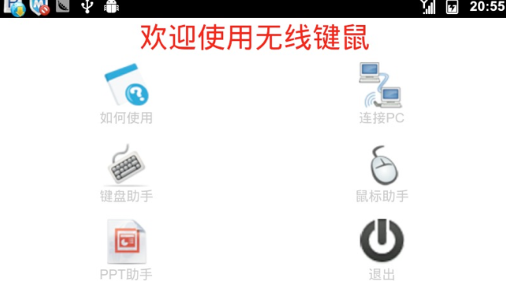
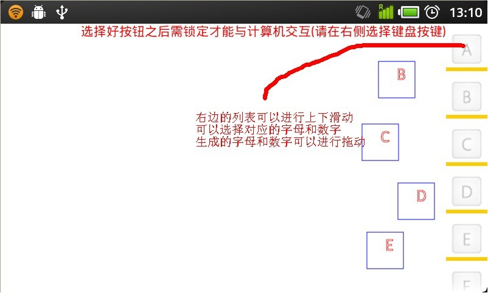

# Medium_01_VirtualMouseKey
2011 Google Android学术合作计划项目

# 关于

本项目拟在Android平台上进行手机应用程序开发流程的探索和实践研究。根据Android开源操作系统的特点，结合手机软件开发的流程，利用Java语言开发一套基于Android智能手机平台的虚拟键鼠软件，实现手机与PC的数据通信与交换，从而将Android智能手机变身为无线键鼠，实现单击鼠标、输入信息、充当游戏手柄等功能，让使用者可以通过手机触屏远距离操作电脑。

# 系统效果

